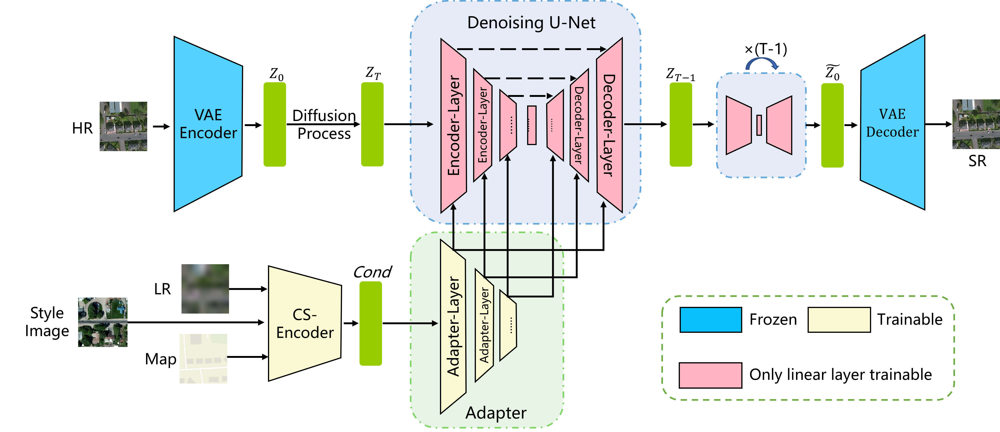
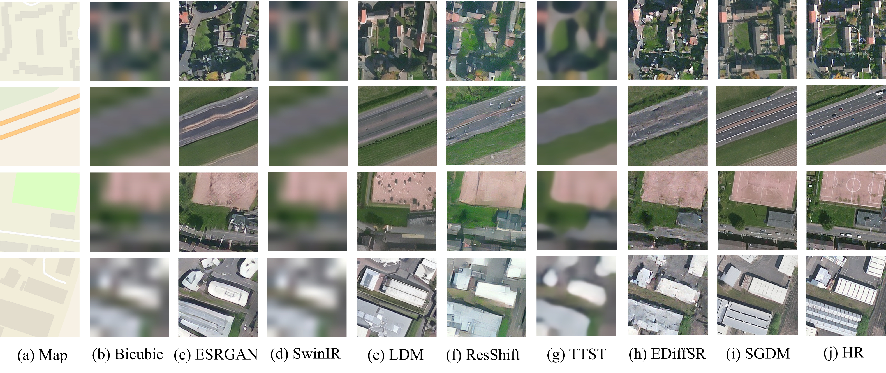
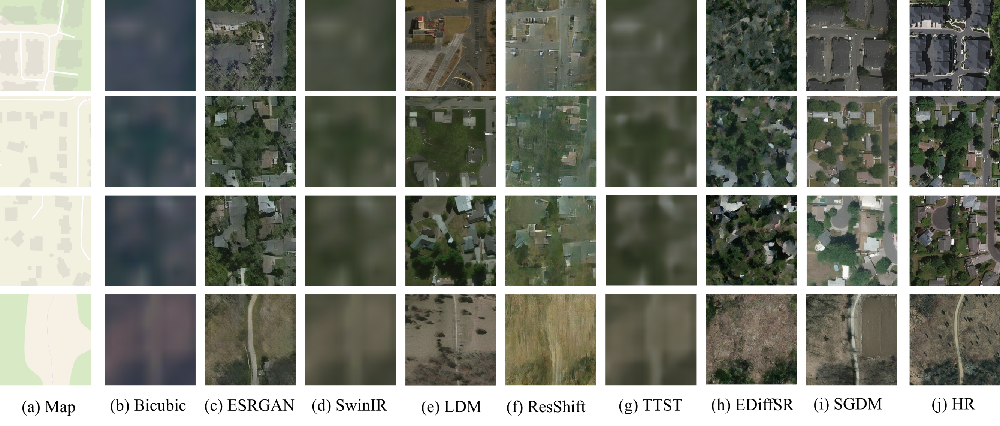
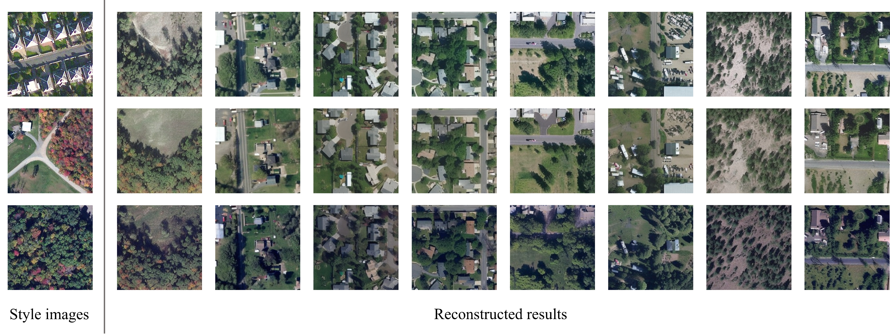
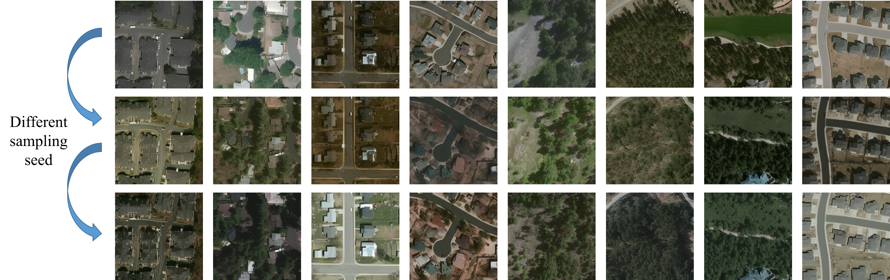

## Semantic Guided Large Scale Factor Remote Sensing Image Super-resolution with Generative Diffusion Prior

[Paper](https://arxiv.org/abs/......)

<p align="center">
    
</p>

## :book:Table Of Contents

- [Visual Results](#visual_results)
- [Installation](#installation)
- [Pretrained Models](#pretrained_models)
- [Inference](#inference)
- [Train](#train)

## <a name="visual_results"></a>:eyes:Visual Results

<!-- <details close>
<summary>General Image Restoration</summary> -->
### Results on synthetic dataset



### Results on real-world dataset



### Results for style guidance



### Results for style sampling



## <a name="installation"></a>:gear:Installation
```shell
# clone this repo
git clone https://github.com/wwangcece/SGDM.git

# create an environment with python >= 3.9
conda create -n SGDM python=3.9
conda activate SGDM
pip install -r requirements.txt
```

## <a name="pretrained_models"></a>:dna:Pretrained Models

[Google Drive](https://drive.google.com/drive/folders/1BTNz0mXGBPpWqqNGq59Bx6_KUFMCWsRq?usp=sharing)

Download the model and place it in the checkpoints/ folder

## <a name="inference"></a>:crossed_swords:Inference

<a name="general_image_inference"></a>
First please modify the validation data set configuration files at configs/dataset

#### Inference for synthetic dataset

```shell
python inference_refsr_batch_simu.py \
--ckpt checkpoints/SGDM-syn \
--config configs/model/refsr_simu.yaml \
--val_config configs/dataset/reference_sr_val_simu.yaml \
--output path/to/your/outpath \
--steps 50 \
--device cuda:0 \
```

#### Inference for real-world dataset

For style sampling
```shell
python inference_refsr_batch_real.py \
--ckpt checkpoints/SGDM-real \
--config configs/model/refsr_real.yaml \
--val_config configs/dataset/reference_sr_val_real.yaml \
--sample_style true \
--ckpt_flow_mean checkpoints/flow_tanh_mini_mean \
--ckpt_flow_std checkpoints/flow_tanh_mini_std \
--output path/to/your/outpath \
--steps 50 \
--device cuda:0 \
```

For style guidance
```shell
python inference_refsr_batch_real.py \
--ckpt checkpoints/SGDM-real \
--config configs/model/refsr_real.yaml \
--val_config configs/dataset/reference_sr_val_real.yaml \
--output 50 path/to/your/outpath \
--steps 50 \
--device cuda:0 \
```

## <a name="train"></a>:stars:Train
TBD

## Citation

Please cite us if our work is useful for your research.

```
...
```

## Acknowledgement

This project is based on [Diffbir](https://github.com/XPixelGroup/DiffBIR). Thanks for their awesome work.

## Contact
If you have any questions, please feel free to contact with me at cewang@whu.edu.cn.
